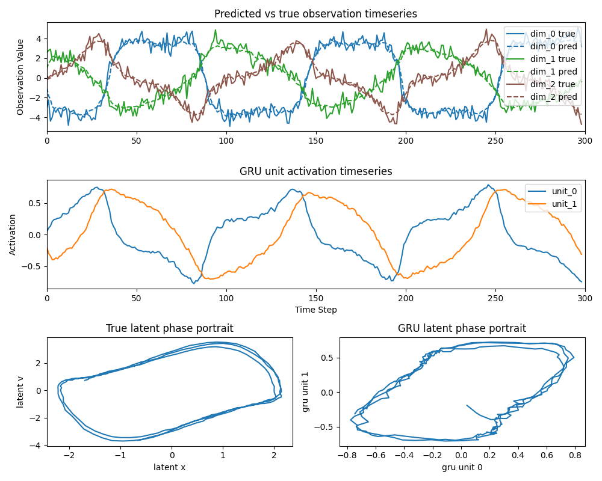

# Modelling latent dynamics with Tiny RNNs

A minimal implementation of using a Tiny RNN to estimate latent dynamics from noisy observations, implemented in [PyTorch](https://pytorch.org/).

### Repository contents

- `script.py` — Entry point: generates synthetic data, trains the model, and plots validation results.
- `simulation.py` — Simulates latent 2D oscillator trajectories and noisy observation sequences.
- `model.py` — Defines a GRU-based sequence predictor with optional input/output ReLU layers.
- `training.py` — Training loop with mini-batch loading, validation loss monitoring, and early stopping when validation loss increases.
- `plotting.py` — Visualisation for true vs predicted observations, GRU activations, and phase portraits.
- `requirements.txt` — Python dependencies.
- `validation_results.png` — Example output figure generated by the pipeline.

© Copyright Thomas Akam 2026. Released under the GPL3 License.

